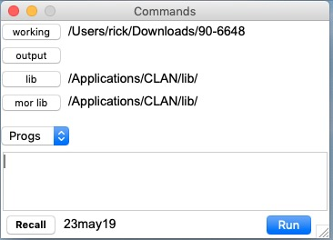
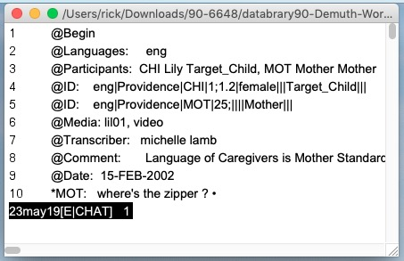
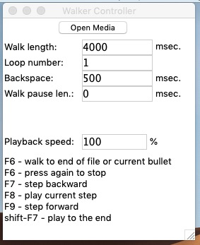
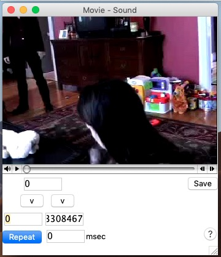
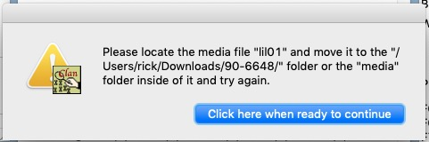

# Background

```{r setup, include=FALSE}
knitr::opts_chunk$set(echo = TRUE, cache = TRUE)
```

This document provides information about current functions of TalkBank and CLAN.

## Terminology

*TalkBank*: Collection of databases hosted at <talkbank.org>.
*CHAT*: Data format for transcripts.
*CLAN*: Child Language ANalysis program. Its XML schema is described here: <https://talkbank.org/software/xsddoc/index.html>.

# TalkBank

## Browser-based visualization (Browsable Database)

Some transcripts are linked with media (audio or video files). 
When the media are linked with a transcript, it is possible to play the video and have the transcript sections highlight in sequence.

Here is an example of this from the Providence corpus:

<https://phonbank.talkbank.org/browser/index.php?url=Eng-NA/Providence/Lily/010102.cha>

Hit the `s` key to start and stop playback.

```{r echo=FALSE, out.width='100%', fig.cap='Screenshot from Providence corpus session from TalkBank'}
knitr::include_graphics('img/providence.jpg')
```

### Annotation layers or tiers

Header metadata are on lines marked with initial `@` symbols.
Speaker utterances are on lines marked with initial `*` asterisk symbols followed by the speaker indicator, here `MOT` for mother and `CHI` for child.
Annotation layers are on lines marked with initial `%` symbols, for example `%com` is a comment, `%sit` refers to situational observations, `%pho` refers to the phonology spoken by the child, etc.

Each of the additional annotation layers that follow an utterance refer to that utterance.

There are right arrow `▶` characters that are clickable buttons to move directly to that section of the video for playback.

The Browsable Database does *not* allow annotation.

### Databrary equivalent

For reference, the relevant Databrary site for this session is here:

<https://nyu.databrary.org/volume/90/slot/6648/-?asset=12339>

Note:

- There is no link to the TalkBank equivalent.
- It is hard to map the TalkBank metadata to Databrary's.
- The filenames are either not shown were not added when the data were curated.

## Browser code

Brian MacWhinney graciously sent us the Browsable Database code.
It is not ours to share here, so I won't.
The code is a combination of JavaScript and PHP.

# CLAN

CLAN is a desktop application.

## Acquire data

Let's use the Databrary API commands to acquire and clean the data prior to opening them in CLAN.

```{r download-providence, include=FALSE}
library(databraryapi)

databraryapi::login_db(email = params$db_login)

databraryapi::download_video(vol_id = 90, asset_id = 22149, vb=TRUE, file_name = 'lil01.mp4')
```

**This fails with HTTP 403 error.** 
So, I downloaded the files manually to `~/Downloads`.

However, let's test whether the video can be rendered directly from Databrary:

```{r}
source("R/write_video_clip_html.R")
```

```{r, results='asis'}
write_video_clip_html(vid_url="https://nyu.databrary.org/slot/6648/0,3308467/asset/12339/download?inline=true")
```

This works, so the problem with accessing the video from the `databraryapi` package is specific to that code.

## Open CLAN

CLAN's *analysis* programs can be run from the command line, but I will use the GUI for now.
I created a folder with the `*.cha` and `*.mp4` with the name `90-6648` referring to the Databrary volume and session.
I opened CLAN and set the `working` directory via the `Commands` window:

```{r echo=FALSE, out.width='25%', fig.cap='CLAN Commands window'}

```

I then selected and opened the `*.cha` transcript from the `File/Open...` menu.

```{r echo=FALSE, out.width='25%', fig.cap='CHAT transcript'}

```

To link the media (video) file, I open the `Walker Controller` window from the `Windows/Walker Controller` menu item.

```{r echo=FALSE, out.width='25%', fig.cap='CLAN Walker Controller'}

```

Then, I click on the `open media` button in the `Walker Controller` window and select the `*.mp4` file from the file browser.
When the video opens, it opens in a `Movie - Sound` window that looks like this:

```{r echo=FALSE, out.width='25%', fig.cap='CLAN Movie Sound'}

```

When I press `F6` to play the video, I get a warning pop-up:

```{r echo=FALSE, out.width='25%', fig.cap='CLAN Warning'}

```

Note that in the CHAT transcript header, there is the following line: `@Media:	lil01, video`.
CLAN needs the video file to be named `lil01*` for this to work.

For expediency, I'll just copy the file and rename it to `lil01.mp4`.
I then click on the `open media` button in the `Walker Controller` window again, select `lil01.mp4`, and when the window opens, try `F6` again.

The video and audio play, but the transcript highlighting is *not* working for some reason.
Steps to try:

- Try with media + CHAT file from TalkBank to see whether the Databrary file is corrupted somehow.
- Redownload CLAN.

### Download from TalkBank

Here is a downloadable link to the (apparently zipped) transcripts: <https://phonbank.talkbank.org/data/Eng-NA/Providence.zip>

And here is a link to the media/video files: <https://media.talkbank.org/phonbank/Eng-NA/Providence/>.

This is the relevant media file for this example:

<https://media.talkbank.org/phonbank/Eng-NA/Providence/Lily/010102.mp4>.

I created a new `providence` folder on my desktop and put the `010102.mp4` and `010102.cha` files in it. 
Note that web downloads from TalkBank have some of the similar file name issues we have on Databrary.
Wait, this `*.cha` file has the right media file name.
The media file loads, and `F6` plays it, but there is no utterance highlighting again.
So, the problem is *not* with the files from Databrary.

I'm going to stop here on 2019-06-18-09:35 to switch to some other projects.


