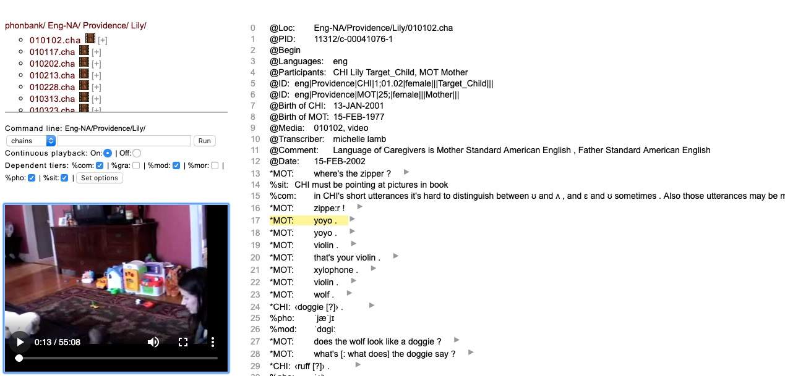

# Background

```{r setup, include=FALSE}
knitr::opts_chunk$set(echo = TRUE, cache = TRUE)
```

This document provides information about current functions of TalkBank and CLAN.

## Terminology

*TalkBank*: Collection of databases hosted at <talkbank.org>.
*CHAT*: Data format for transcripts.
*CLAN*: Child Language ANalysis program.

# TalkBank

## Browser-based visualization (Browsable Database)

Some transcripts are linked with media (audio or video files). 
When the media are linked with a transcript, it is possible to play the video and have the transcript sections highlight in sequence.

Here is an example of this from the Providence corpus:

<https://phonbank.talkbank.org/browser/index.php?url=Eng-NA/Providence/Lily/010102.cha>

Hit the `s` key to start and stop playback.

```{r echo=FALSE, out.width='100%', fig.cap='Screenshot from Providence corpus session from TalkBank'}

```

### Annotation layers or tiers

Header metadata are on lines marked with initial `@` symbols.
Speaker utterances are on lines marked with initial `*` asterisk symbols followed by the speaker indicator, here `MOT` for mother and `CHI` for child.
Annotation layers are on lines marked with initial `%` symbols, for example `%com` is a comment, `%sit` refers to situational observations, `%pho` refers to the phonology spoken by the child, etc.

Each of the additional annotation layers that follow an utterance refer to that utterance.

There are right arrow `▶` characters that are clickable buttons to move directly to that section of the video for playback.

The Browsable Database does *not* allow annotation.

### Databrary equivalent

For reference, the relevant Databrary site for this session is here:

<https://nyu.databrary.org/volume/90/slot/6648/-?asset=12339>

Note:

- There is no link to the TalkBank equivalent.
- It is hard to map the TalkBank metadata to Databrary's.
- The filenames are either not shown were not added when the data were curated.

## Browser code

Brian MacWhinney graciously sent us the Browsable Database code.
It is not ours to share here, so I won't.
The code is a combination of JavaScript and PHP.

# CLAN

CLAN is a desktop application.

## Acquire data

Let's use the Databrary API commands to acquire and clean the data prior to opening them in CLAN.

```{r download-providence, include=FALSE}
library(databraryapi)

databraryapi::login_db(email = params$db_login)

databraryapi::download_video(vol_id = 90, asset_id = 22149, vb=TRUE, file_name = 'lil01.mp4')
```

**This fails with HTTP 403 error.** 
So, I downloaded the files manually to `~/Downloads`.

However, let's test whether the video can be rendered directly from Databrary:

```{r}
source("R/write_video_clip_html.R")
```

```{r, results='asis'}
write_video_clip_html(vid_url="https://nyu.databrary.org/slot/6648/0,3308467/asset/12339/download?inline=true")
```
